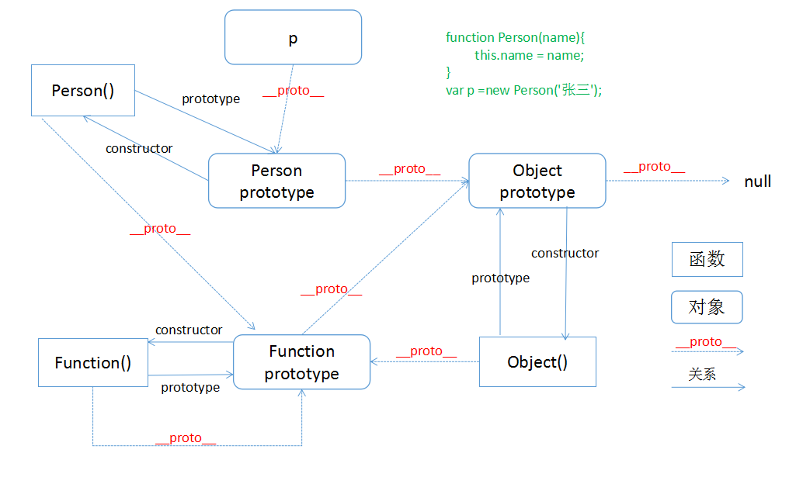
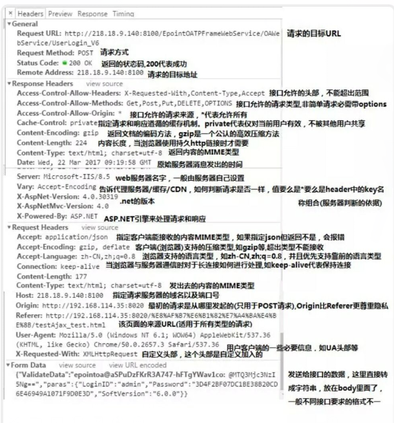

# 一、js基础

## 基础

### js中使用`typeof`能得到的哪些类型？

>本题主要考察 js中的 **数据类型**

    js中数据类型：
    简单型（值类型）

        - number (数字)
        - string (字符)
        - boolean (布尔值)
        - null (空对象指针 typeof为object)
        - undefined (值未定义)
        - symbol (表示独一无二的值，es6添加的数据类型)
    复杂型（引用类型）
        - object (对象)

    本题答案是：number,string,boolean,undefined,object,function(函数),symbol

### 何时使用`===` 何时使用`==`？

此题会考虑的是类型转换，当你确定两个值类型也要相等的时候就使用`===`，使用`==`时  

    ```javascript

    null == undefined
    '1' == 1
    0 == ''
    0 == false
    1 == true
    ```

### 解决js浮点丢失问题

`Math.floor(运算结果 * 100)/100`

### js中的内置函数

Object,Array,Boolean,Number,String,Function,Date,RegExp,Error

### 哪些值为false

0,NaN,'',null,undefined,false

### 如何准确判断一个变量是数组类型？

    ```JavaScript
    var arr = [1,2,3];
    arr instanceof Array //true

    //es5
    Array.isArray(arr); //true

    Object.prototype.toString().call() // [Object Array]

    ```

## 原型

每个函数都有一个`prototype`属性，这个属性是一个指针，指向一个对象,这个就是原型对象，它里面有一个属性`construcotr`属性，其值指向函数本身，`prototype`可以自定义增加许多属性。实例化这个函数，实例对象就能继承构造器函数上的对象和方法。

## 原型链

每个函数或者对象都有一个`__proto__`隐藏属性，这个引用了创建这个对象的函数的`prototype`，这样这个对象就和创建它的函数关联起来。如果这个对象本身没有这个属性和方法，它就会顺着`__proto__`向创建它的函数的原型中查找。这样就行了原型链。

### 画出下题的完整原型链

    ```JavaScript
    function Person(name){
        this.name = name;
    }
    var p = new Person('张三');
    ```

 

总结：所有的函数`__proto__`都指向`Function prototype`,包括`new Function()`本身。所有的函数`prototype`对象的`__proto__`(除了Object)都指向`Object prototype`。`Object prototype`对象的`__proto__`指向`null`。对象只有`__proto__`属性。

### 创建对象的几种方式

1. `var o1 = {name:'o1'}`字面量的方式创建对象
2. `var M = function(name){this.name =  name}; var o2 = new M('o2');` 通过构造函数
3. `var P = {name:'o3'}; var o3 = Object.create(p);` 通过`Object.create`方式

### 类的声明

1. 普通function  

    ```javascript
    function Person(name,age){
        this.name = name;
        this.age = age;
    }
    ```

2. ES6 class声明
    ```javascript
    class Person(){
        constoructor(name,age){
            this.name = name;
            this.age = age;
        }
    }
    ```

### 类的继承方式

1. call/apply
    ```javascript
    
    function Parent(){
        this.name = 'Parent';
    }
    function Child(){
        Parent.call(this);
        this.type = 'Child';
    }
    ```

    缺点：子类拿不到父类原型中的方法

2. 利用原型继承

    ```javascript
    function Parent(){
        this.name = 'Parent';
    }
    function Child(){
        this.type = 'Child';
    }
    Child.prototype = new Parent();
    ```

    缺点：constoructor并不指向子类构造函数，Child多个实例引用同一个对象，这就造成修改一个实例继承中的属性，其他实例继承的属性也会跟着变动

3. 组合方式
    ```javascript
    function Parent(){
        this.name = 'Parent';
    }
    function Child(){
        Parent.call(this);
        this.type = 'Child';
    }
    Child.prototype = new Parent();
    ```
    缺点：constoructor并不指向子类构造函数,实例化一个子类会调用2次父类构造函数

4. 组合继承优化
    ```javascript
    function Parent(){
        this.name = 'Parent';
    }
    function Child(){
        Parent.call(this);
        this.type = 'Child';
    }
    Child.prototype = Object.create(Parent.prototype);
    Child.prototype.contoructor = Child;

    ```

### Promise三种状态

1. pending(进行中)
2. fulfilled(已成功)
3. rejected(失败)

### this的指向问题

1. 函数作为对象的方法被调用时，this指向该对象
2. 函数为普通函数时调用，this指向全局window对象
3. 函数作为构造函数调用时，this指向new出来的新对象
4. apply/call/bind调用时this指向方法的第一个参数
5. 箭头函数里面的this指向箭头函数上一层的this

### new(操作符) 发生了什么？

1. 创建一个全新的对象
2. 这个新对象会被执行原型连接,连接到构造函数中的原型上去
3. 这个全新的对象会绑定到函数调用的this
4. 如果函数没有返回其他对象，那么new表达式中的函数调用会返回这个新对象

### apply、call、bind三者区别

1. apply()方法调用一个函数，第一个参数指定了函数体内的this，第二个参数为一个带下标的集合，可以数组也可以为类数组。
2. call()方法和apply()一样，唯一就是从第二个参数开始外后，每个参数被依次传入函数。
3. bind()方法创建一个新的函数，第一个参数指定了函数体内的this，从第二个参数开始外后，每个参数被依次传入函数。bind()返回的是一个修改过后的函数

## DOM操作

1. `window.onload` 和 `DOMContentLoaded`的区别？
2. 用js创建10个`<a>`标签，点击的时候弹出来对应的序号

### 类库和框架有什么区别

### HTTP协议的主要特点

1. 简单快速,只需要传输请求方法和路径，就能进行访问。
2. 灵活，可以通过http传输任意类型的数据，只需要设定content-type就可以进行传输。
3. 无连接,服务器收到客户端请求之后，响应完成并收到客户端的应答之后既断开，限制每次的连接只处理一次请求。从而节省传输时间。
4. 无状态，http协议对事物处理没有记忆能力。也就意味着如果需要前面的信息，只能重传，这无形之中增加数据的传输量。

### HTTP报文组成部分

1. 请求报文
    + 请求行
    + 请求头
    + 空行
    + 请求体
2. 响应报文
    + 状态行
    + 响应头
    + 空行
    + 响应体

### 常用的HTTP动词

1. GET 获取资源
2. POST 传输资源
3. PUT 更新资源
4. DELETE 删除资源
5. HEAD 获取报文首部

### post与get的区别

1. GET在浏览器回退时是无害的，而POST会再次提交请求.
2. GET产生的URL地址可以被收藏，而POST不可以
3. GET请求会被浏览器主动缓存，而POST不会，除非手动设置.
4. GET请求只能进行URL编码，而POST支持多种编码方式
5. GET请求参数会被完整的保留在浏览器历史记录中，而POST中的参数不会被保留.
6. GET请求在URL中传送的参数是有长度限制的，而POST没有限制.
7. 对参数的数据类型，GET只接受ASCII字符，而POST没有限制
8. GET比POST更不安全，因为参数直接暴露在URL上，所以不能用来传递敏感信息
9. GET参数通过URL传递，POST放在Request body中.

### 常见的HTTP状态码

1. 1xx：指示信息，表示请求已接收，继续处理
2. 2xx：成功，表示请求已被成功接受
    + 200 客户端请求成功
    + 206 客户端发送了一个带有Range头的Get请求，服务器完成了
3. 3xx：重定向，要完成请求必须进行更进一步的操作
    + 301 请求的页面已经转移到新的URL
    + 302 请求的页面已经临时转移到新的URL
    + 304 客户端有缓存的文档并发出了一个条件性的请求，服务器告诉客户端继续使用原来缓存的文档
4. 4xx：客户端错误，请求有语法错误或者请求无法实现
    + 400 客户端语法错误，不能被服务器所理解
    + 401 请求未经授权
    + 403 被请求页面的访问被禁止
    + 404 请求资源不存在
5. 5xx：服务端错误，服务器未能实现合法的请求
    + 500 服务器发生不可预期的错误，原来缓存的文档还可以继续使用
    + 503 请求未完成，服务器临时过载或宕机，一段时间后可能恢复正常

### HTTP持久连接

HTTP协议采用“请求-应答”模式，当使用普通模式，即非`Keep-Alive`模式时，每个/应答客户和服务器都要新建一个连接，完成之后立即断开连接,无连接协议。当使用`Keep-Alive`模式（又称持久连接、连接重用）时，客户端到服务器端的连接持续有效。HTTP1.1之后支持

### 管线化

在使用持久连接的情况下，一般请求是请求一次响应一次。而管线化可以打包多次请求完，任何响应多次请求。

1. 管线化通过持久连接完成，只有HTTP1.1支持此技术
2. 只有GET和HEAD请求可以进行管线化，而POST则有所限制
3. 管线化不会影响响应到来的顺序。
4. HTTP/1.1要求服务端支持管线化。

### 如何封装一个ajax

```javascript
function ajax(options){
    var url = options.url;
    var type = options.type.toUpperCase() || 'GET';
    var data = options.data || {};
    var sync = options.sync || false;
    var success = options.success;
    var error = options.error;
    if(url){
        var xhr = XMLHttpRequest? new XMLHttpRequest() : new window.ActiveXObject('Microsoft.XMLHTTP');
        var dataArr = [];
        for(var k in data){
            dataArr.push(k+'='+data[k]);
        }
        if(type === 'GET'){
            url = url+'?'+dataArr.join('&');
            xhr.open(type,url,sync);
            xhr.send();
        }
        if(type === 'POST'){
            xhr.open(type,url,sync);
            xhr.setRequestHeader('Contenxt-Type','application/x-www-form-urlencoded');
            xhr.send(dataArr.join('&'));
        }
        xhr.onload=function(){
            if(xhr.status === 200 || xhr.status === 304){
                var res =xhr.responseText;
                if(typeof res === 'string'){
                    success && success(JSON.parse(res));
                }
            }else{
                error && error('err',xhr.status)
            }
        }
    }
}
```

### xhr.onload 和xhr.onreadystatechange 区别

xhr在创建到建立通讯、传输、响应是一系列过程，任何状态改变都会触发`onreadystatechange`,而请求完成才会触发`onload`。

### XMLHttpRequest对象中的readystate每个阶段状态代表什么

### 什么是同源策略

同源策略是浏览器安全必要的策略，限制只能从一个源加载文档，这是用于隔离潜在恶意文件的安全机制。域名，协议，端口这3种不通源不一样就是跨域了。

1. Cookie、LocalStorage和IndexDB无法获取
2. DOM无法获得
3. ajax不能获取

### 前后端如何通讯

1. ajax
2. WebSocket
3. CORS

### 如何跨域

1. CORS（跨域资源共享）,CORS需要浏览器和服务器同时支持，需要服务器设置`Access-Control-Allow-Origin`。
2. 代理工具。例如：webpack proxy。
3. 服务器反向代理。
4. JSONP
5. WebSocket

### 跨域简单请求和非简单请求

1. 请求方式是`GET`、`HEAD`和`POST`，并且请求是`POST`时，`Content-Type`必须是`application/x-www-form-urlencoded`，`multipart/form-data`或着`text/plain`中的一个值。
2. 请求中没有自定义HTTP头部。
3. 非简单请求都会在正式通讯前，增加一次HTTP查询请求`OPTIONS`,来确认是否允许跨域。

### 跨域如何携带Cookie

1. 设置`XMLHttpRequest` 的`withCredentials = true`。
2. 同时`Access-Control-Allow-Origin`就不能设为星号，必须指定明确的、与请求网页一致的域名。
3. 同时，Cookie依然遵循同源政策，只有用服务器域名设置的Cookie才会上传，其他域名的Cookie并不会上传，且（跨源）原网页代码中的`document.cookie`也无法读取服务器域名下的Cookie。

### 什么是jsonp以及优缺点

JSONP 利用DOM中的script标签src属性来请求，请求中带有参数callback=函数（回调数据），后端配合返回函数，同时把数据放在函数的参数中。

优点：

1. 兼容性好，不管是什么浏览器都支持。
2. 不需要`XMLHttpRequest`或者`AciveX`的支持。

缺点：

1. 只支持`GET`请求
2. 只支持跨域HTTP请求这种情况
3. 不能解决不同域的两个页面之间如何进行JavaScript调用的问题
4. 不安全，铭文传送

### 浏览器输入url发生了什么

1. `DNS`域名解析。首先找到本地的`hosts`文件，如果有则向`IP`地址发送请求，如果没有在去找DNS服务器
2. 建立`TCP`链接。三次握手：客户端发送一个带有SYN标注的数据包给服务端，服务端收到后，回传一个带有`SYN/ACK`标注的数据包以示传达信息，最后客户端再回传一个带ACK标志的数据包，代表握手成功，建立链接。
3. 发送HTTP请求。请求报文结构如下图
    + 请求行(`General`)
    + 返回头(`Response Headers`)
    + 请求头(`Request Headers`)
    + 请求数据(`Form Data`)
4. 服务器处理请求。`web`服务器解析用户请求，调度资源，处理用户请求和参数，并调用数据库查询。最后将结果通过`web`服务器返回给浏览器客户端
5. 返回响应结果
6. 关闭`TCP`连接，为了避免服务器和客户端双方的资源占用和消耗，当双方没有请求或者响应传递时，任意一方都可以发起关闭请求。关闭`TCP`连接需要4次握手。客户端发送`FIN`，服务端返回`ACK`,然后接着服务端又返回`FIN`，客户端在返回`ACK`
7. 浏览器解析`HTML`。浏览器需要加载解析的不仅仅时HTML，还包括`js`,`css`以及图片和其他的资源文件。
8. 浏览器布局渲染



### 前端代码重构思路

1. 删除无用代码，精简代码
    + 删除无用的`css`和`javascript`,删除`javascript`中已经无用的方法
2. 前端代码规范
    + 把页面中内联样式及头部样式提取到单独的css文件中
    + 调整代码的缩进
    + 更改标注已经不支持的标签如:`<b>`
    + 在`javascript`中减少全局变量的使用，缩小变量的作用域
    + 整理基础类库,减少因为版本的问题造成多个文件
3. 前端代码模块化
    + 按模块归类`css`代码与`js`代码，放到模块对应的文件夹中
    + 按模块分离`js`代码，定义不同的命名空间
4. 提高页面加载性能
    + 将不影响首页展现的`javascript`文件延迟到页面加载后加载
    + 删除页面中初始隐藏的区域
    + javascript改为按需加载
    + 图片的懒加载
    + 调整`css`和`js`的引用顺序
    + 给静态文件设置缓存
    + 加载`CDN`上的文件
    + 图片合并

## 安全

### 如何预防xss攻击

>主要还时过滤特殊字段和编码预防

1. 设置`HttpOnly`防止劫取`Cookie`
2. 输入检查是否包含特殊字符，如<、>、'、"等，发现则将这些字符过滤或者编码
3. 输出检查，对变量使用`HtmlEncode`，js变量输出一定在引号内，可以过滤除数字字母以外所有字符，
4. 在事件中输出，同3方法
5. 在css中输出，css中进行编码
6. 在地址栏中输出，使用js中的`encodeURI`或者`encodeURIComponent`方法

### CSRF跨站请求伪造

原理利用用户存在本地的cookie，来伪造请求

1. Token验证
2. Referer验证（页面验证，是否是自己源）
3. 隐藏令牌

## DOM事件

### DOM事件的级别

1. DOM0事件 `ele.onclick=function(){}`
2. DOM2事件 `ele.addEventListener('click',function(){},false)`;最后一个布尔值参数如果是`true`,表示在捕获阶段调用事件处理程序，如果为`false`，表示在冒泡阶段调用事件处理程序。IE：`ele.attachEvent('onclick',function(){})`
3. DOM3事件 DOM3事件在DOM2事件基础上重新定义了这些事件，也增加了一些新的事件。如：UI事件（load），焦点事件，鼠标事件，滚轮事件，键盘事件，合成事件。

### DOM事件模型

1. 捕获，从document对象首先接收到事件，然后事件沿DOM树依次向下，一直传播到事件的实际目标。
2. 冒泡，从实际目标元素事件沿DOM树向上传播，在每一级节点都会发生，知道传播到document对象。

### DOM事件流

1. 事件捕获阶段
2. 处于目标阶段
3. 事件冒泡阶段

### 描述DOM事件捕获的具体流程

`document=>html=>body=>div=>`...实际目标

### Event对象的常见应用

#### 非IE

1. event事件对象的方法
    + 阻止默认事件 `event.preventDefault()`.
    + 阻止冒泡 `event.stopPropagation()`

2. event事件对象的属性
    + 事件的目标 `target`
    + 事件的类型 `type`
    + 事件处理程序当前正在处理的那个元素 `currentTarget`

#### IE

1. `cancelBubble`默认为`false`,设置为`true`可以取消事件冒泡
2. `returnValue`默认为`true`，设置为`false`可以取消事件的默认行为
3. `srcElement`事件的目标
4. `type`事件的类型

### 自定义事件

自定义事件需要自己封装，实现功能。

### 浏览器渲染过程

1. 解析html构建dom树。浏览器将html解析成dom树，前节点的所有子节点都构建好后才会去构建当前节点的下一个兄弟节点。
2. 将css解析成css rule树
3. 构建render树。根据DOM树和CSS rule 树来构造 Rendering Tree
4. 布局render树。有了Render Tree，浏览器已经能知道网页中有哪些节点、各个节点的CSS定义以及他们的从属关系。下一步操作称之为layout，顾名思义就是计算出每个节点在屏幕中的位置。
5. 绘制render树。再下一步就是绘制，即遍历render树，并使用UI后端层绘制每个节点。

### 如何理解js的单线程

一个事件之内js只能做一件事情.

### 什么是任务队列

1. 同步任务
2. 异步任务

### 异步任务有哪些

1. setTimeout和setInterval
2. DOM事件
3. ES6中的Promise
4. XHRHttpRequest

## 性能提升

### 提升页面性能的方法有哪些

1. 资源压缩合并，减少HTTP请求
2. 非核心代码异步加载
3. 利用浏览器缓存
4. 使用CDN
5. 预解析CDN

### 异步加载的方式

1. 动态脚本加载
2. defer
3. async

### 异步加载的区别

1. defer 是在HTML解析完之后才会按照加载顺序依次执行
2. async 是在加载完之后立即执行，与顺序无关

### 浏览器缓存

1. 强缓存（不咨询服务器，直接使用本地缓存）
    + Expires
    + Cache-Control
2. 协商缓存（咨询服务器，在判断是否使用本地缓存）
    + Last-Modified If-Modified-Since
    + Etag If-None-Match

## 错误监控

### 前端错误分类和捕获方式

1. 即时运行错误：代码出错
    + `try..catch`
    + `window.onerror`
2. 资源加载出错
    + `object.onerror`
    + `performance.getEntries()`
    + `Error`事件捕获

### 上报错误的基本原理

1. 采用ajax通信的方式上报
2. 利用image对象上报，使用src='上报请求路径'

## es6

### 箭头函数与普通函数有什么不同

1. 箭头函数是匿名函数，不能作为构造函数，不能使用`new`
2. 箭头函数不绑定`arguments`
3. 箭头`this`永远指向其上下文的this，任何方法都改变不了其指向，如`call bind apply`
4. 箭头函数没有原型属性
5. 箭头函数不能当做`generator`函数，不能使用`yield`关键字

## 模块化

### AMD

1. require.js
2. 全局define函数
3. 全局require函数
4. 依赖的js会自动异步加载

### Commonjs

1. nodejs模块化规范
2. npm中获取
3. 构建工具自动化，使用npm成本低
4. Commonjs不会异步加载js，而是同步一次性加载出来

### export 和export default

> `export default`命令用于指定模块的默认输出。一个模块只能有一个默认输出，因此`export default`命令只能使用一次。所以，`import`命令后面才不用加大括号，因为只可能唯一对应`export default`命令。

1. `export`是多个,`import`就要写对`export`导出出来的名称
2. `export default` 单独导出来的，`import`可以自己取名
3. `export default` 不能使用花括号


从输入URL到渲染出整个页面的过程包括三个部分：

1、DNS解析URL的过程

2、浏览器发送请求与服务器交互的过程

3、浏览器对接收到的html页面渲染的过程

一、DNS解析URL的过程

      DNS解析的过程就是寻找哪个服务器上有请求的资源。因为ip地址不容易记忆，一般会使用URL域名（如www.baidu.com）作为网址。DNS解析就是将域名翻译成IP地址的过程。

具体过程：

       1）浏览器缓存：浏览器会按照一定的频率 缓存DNS记录

 　　2）操作系统缓存：如果浏览器缓存中找不到需要的DNS记录，就会取操作系统中找

　　 3）路由缓存：路由器也有DNS缓存

　　 4）ISP的DNS服务器：ISP有专门的DNS服务器应对DNS查询请求

　　 5）根服务器：ISP的DNS服务器找不到之后，就要向根服务器发出请求，进行递归查询

二、浏览器与服务器交互过程

　　1）首先浏览器利用tcp协议通过三次握手与服务器建立连接

　　http请求包括header和body。header中包括请求的方式（get和post）、请求的协议 （http、https、ftp）、请求的地址ip、缓存cookie。body中有请求的内容。

　　2）浏览器根据解析到的IP地址和端口号发起http的get请求.

　　3）服务器接收到http请求之后，开始搜索html页面，并使用http返回响应报文

　　4）若状态码为200显示响应成功，浏览器接收到返回的html页面之后，开始进行页面的渲染

三、浏览器页面渲染过程

　　1）浏览器根据深度遍历的方式把html节点遍历成dom 树

　　2）将css解析成CSS DOM树

　　3）将dom树和CSS DOM树构造成render树

　　4）JS根据得到的render树 计算所有节点在屏幕中的位置，进行布局（回流）

　　5）遍历render树并调用硬件API绘制所有节点（重绘）

     补充： 构造render渲染树的过程

      

从DOM树的根节点开始遍历每个可见的节点。
对于每个可见的节点，找到CSS树中的对应的规则，并且应用他们。
根据每个可见的节点及其对应的样式，组合生成渲染树。