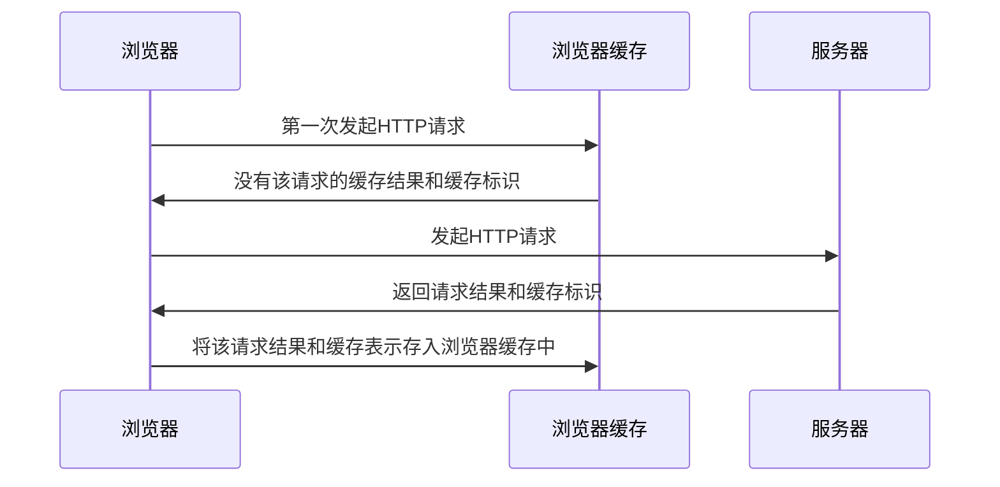
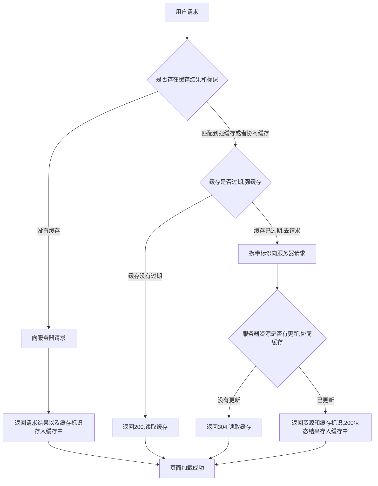

# 浏览器的缓存机制

## 缓存位置

> 从缓存的位置来说分为四种，各自有优先级

### Memory Cache 内存缓存

直接从内存中拿资源。当关闭该页面此资源也就被内存释放掉，内存缓存是浏览器最先尝试去命中的一种缓存。

### Service Worker

是运行在浏览器背后独立的线程，一般可以用来实现缓存功能。

Service Worker的缓存与浏览器其他的缓存机制不同，它可以让我们自由控制缓存哪些文件，如何读取缓存，并且缓存是持续性的。

### Disk Cache 磁盘缓存

从磁盘中拿取资源，不会请求服务器，此资源不会因为该页面关闭而被释放掉，对比Memory Cache胜在储存容量和时效上

### Push Cache 推送缓存

是HTTP2.0中的内容，当以上三种缓存都没有命中，它才会被使用，它只会在会话中存在，一旦会话结束就被释放，并且缓存时间也很短暂，5分钟左右。

## 缓存过程分析

> 浏览器与服务器通信的方式为应答模式，即是：浏览器发起HTTP请求，服务器响应请求返回结果。



1. 浏览器每次发起请求，都会现在浏览器缓存中查找该请求的结果以及缓存标识
2. 浏览器每次拿到返回的请求都会将该结果和缓存标识存入浏览器中

## 缓存策略

### 强缓存

> 不会向服务器发送请求，直接从缓存中读取资源，请求返回200的状态，一般是从Memory Cache或者从Disk Cache中拿，强缓存通过HTTP header来设置。强缓存分为两种

1. Expires

   HTTP1.0的产物，它的值是一个具体的时间值，表示资源会在这个时间值之后过期。

   缺点：受限与本地时间，如果修改了本地时间，可能会造成缓存失效

2. Cache-Control

   在HTTP1.1的版本中，表示资源会在多少秒后过期，需要再次请求。一般设置`Cache-control:max-age=秒`，Cache-control有多个缓存指令可以一起配合使用。

Cache-control会优先于Expires。Expires现阶段为了向下兼容其他低版本浏览器。

强缓存的缺点：强缓存判断是超出某个时间或者某个时间段，而不关心服务端文件是否更新，这个导致加载的文件可能可能不是服务器最新的内容，这时候需要协商缓存。

### 协商缓存

> 协商缓存会在强缓存失效后浏览器携带标识向服务器请求，由服务器根据协商缓存标识决定是否使用缓存。协商缓存分为两种

1. Last-Modified 和 If-Modified-Since

   浏览器第一次请求资源，服务器返回的同时response header中添加Last-Modified header值，表示这个资源在服务器最后修改的时间。浏览器下一次请求检查到有Last-Modified这个header，浏览器会添加If-Modified-Since这个header，值就是last-Modified中的时间。服务器收到这个资源请求会根据If-Modified-Since的值与服务器中这个资源的最后修改时间对比，如果没有变化返回304和空的响应体。如果If-Modified-Since的值小于服务器中这个资源的最后修改时间，说明文件有更新，于是返回新的资源文件和200的状态。

   缺点：

   + 如果打开本地缓存文件，即使没有对文件做修改，Last-Modified的值就会改变，服务端不能命中导致发送相同的资源。
   + Last-Modified以秒计时，如果在不可感知的时间内修改完成文件，那么服务端会认为资源还是命中，不会返回正确的资源。
   
2. ETag标识字符串

   ETag是由服务器为每个资源生成唯一标识字符串，这个标识字符串是基于文件内容编码，只要文件不同，他们对应的ETag就不同。

   浏览器在下一次向服务器发送请求，会将上一次返回的ETag值放到request header里的If-None-Match中,服务器对比客服端传来的If-None-Match跟自己服务器上该资源的ETag是否一致。如果不匹配那么正常去请求返回200和新的ETag发给客户端。如果ETag一致，则返回304给客户端 直接使用本地缓存即可。
   
   ETag会优于Last-Modified命中
   
## 图解

### 协商缓存

   图解：

   + 协商缓存生效，返回304和Not Modified

   ```mermaid
   sequenceDiagram
    	participant 浏览器
     participant 浏览器缓存
     participant 服务器
   	浏览器 ->> 浏览器缓存:发起HTTP请求
   	浏览器缓存 ->> 浏览器:该请求的缓存结果失效，则值返回缓存标识
   	浏览器 ->> 服务器:携带该资源的缓存表示，发起HTTP请求
   	服务器 ->> 浏览器:304，该资源无更新
   	浏览器 ->> 浏览器缓存:从缓存中拿资源
   	浏览器缓存 ->> 浏览器:返回该请求的缓存结果
   ```

   + 协商缓存失效，返回200和请求结果

     ```mermaid
     sequenceDiagram
      	participant 浏览器
       participant 浏览器缓存
       participant 服务器
     	浏览器 ->> 浏览器缓存:发起HTTP请求
     	浏览器缓存 ->> 浏览器:该请求的缓存结果失效，则值返回缓存标识
     	浏览器 ->> 服务器:携带该资源的缓存表示，发起HTTP请求``	
     	服务器 ->> 浏览器:该资源更新,重新返回请求结果,200
     	浏览器 ->> 浏览器缓存:将该请求结果和缓存表示存入浏览器缓存中
     ```

### 整缓存过程

