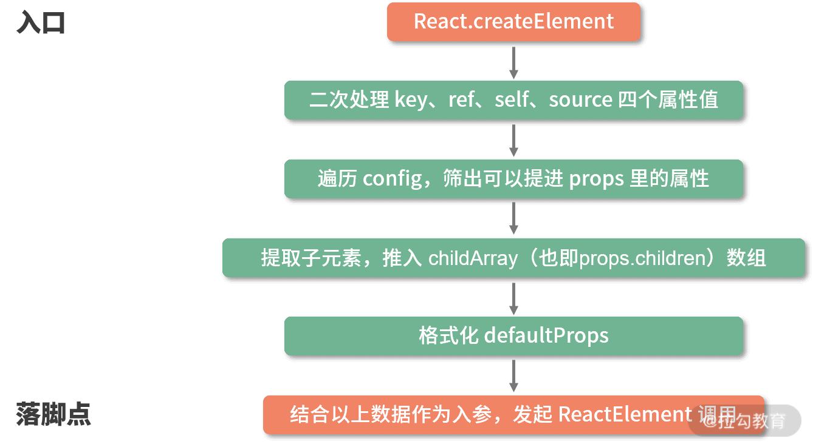
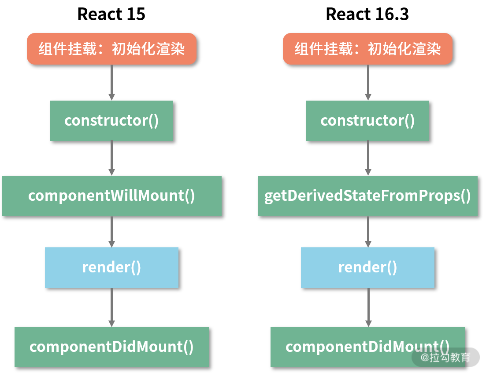

# 深入React

## JSX的本质是什么？

本质是javaScript的语法扩展，它和模板语言很接近，但是它充分具备javascript能力。

jsx会被babel编译为`React.createElement()`，然后`React.createElement()`将返回一个叫做"React Element"的js对象。

所以他的本质就是`React.createElement`这个js调用的语法糖。

### jsx对比直接调用React.createElement的优点：

+ jsx代码层次分明、嵌套关系清晰
+ React.createElement代码给人一种混乱的感觉，不易阅读，写起来也很费劲。
+ JSX语法糖允许前端开发者使用类HTML标签语法来创建虚拟DOM，降低学习成本、提高研发效率和开发体验

### createElement这个方法

createElement有3个入参，这个3个参数囊括了React创建一个元素所需要的全部信息。

`export function createElement(type, config, children)`

+ type：用于标识节点的类型。它可以是类似"h1","div"这样的标准html标签字符串，也可以是React组件类型或者React fragment类型
+ config：以对象形式传入，组件所有的属性都会以键值对的形式存储在config对象上(props)
+ children：以对象行式传入，组件标签之间的嵌套的内容，也就是所谓的子节点，子元素


### createElement函数体拆解



createElement中并没有十分复杂的涉及算法或真实DOM的逻辑，它的每一个步骤都在格式化数据。它是一个转换器、一个数据处理层，将这些参数按照ReactElement的预期做一层格式化，最终通过调用ReactElement来实现元素的创建。


### ReactElement函数


经过React.crateElement处理格式化后把格式化后的参数传入到ReactElement函数中。ReactElement只做了一件事情，那就是组装了一个对象element对象，并把它返回给了React.createElement,然后React.createElement又把它交给了开发者手中。如下图


下面的jsx语法最后会被编译成：

```jsx
const AppJSX = (<div className="App">
  <h1 className="title">I am the title</h1>
  <p className="content">I am the content</p>
</div>)
console.log(AppJSX)
```


这个ReactElement对象实例，本质上是以js对象形式存在的对DOM的描述，也就是虚拟DOM中的一个节点。如果想要成为真实的DOM就必须调用`ReactDOM.render`方法

### 总结


## 生命周期详解

### 虚拟DOM：React 框架核心算法的基石

虚拟DOM工作流

组件在初始化，通过调用生命周期中的render方法，生成虚拟DOM，在通过调用ReactDOM.render方法，实现虚拟DOM到真实DOM的转换。

当组件更新时，会再次通过调用render方法生成新的虚拟DOM，然后借助diff定位出两次虚拟DOM的差异，从而针对发生变化的真实DOM作为定向更新。


### 组件化：工程化思想在框架中的落地

在一个React项目中，每个组件既是“封闭”的，也是“开放的”

封闭：在组件自身的渲染工作流中，每个组件都只处理它内部的渲染逻辑。在没有数据流交互的情况下，组件与组件之间可以做到“各自为政”。

开放：针对组件间通信来说。React基于“单向数据流”的原则完成组件间的通信。而组件之间的通信又将改变通信双方/某一方内部的数据，进而对渲染结果构成影响。所以组件之间彼此开放的，是可以相互影响。

这一开发封闭原则，使得React组件既专注又灵活，具备高度的可重用性和可维护性。


### 生命周期：React15说起

下图是React15的声明周期


#### componentWillReceiveProps到底是由谁触发？

componentWillReceiveProps子组件更新自身的state是不会触发。

componentWillReceiveProps并不是由props的变化触发的，而是由父组件的更新触发的。

如果父组件导致自身组件重新渲染，即使没有props传递给子组或者没有更改，子组件也会调用此方法。如果只想处理更改，请确保进行当前值与变更值的比较。


### 组件卸载被触发条件

+ 组件在父组件中被移除了。
+ 组件中设置了key属性，父组件在render过程中发现key值和上一次不一致，那么这个组件就会被干掉。


### 进化的生命周期方法：React 16生命周期工作详解

React 16生命周期如图：


#### 初始化阶段




**消失的 componentWillMount，新增的 getDerivedStateFromProps**

getDerivedStateFromProps 不是 componentWillMount 的替代品，而是试图替换掉 componentWillReceiveProps，因此它有且仅有一个用途：使用 props 来派生/更新 state。

第一个重点：该方法是一个静态方法。静态方法不依赖组件实例而存在，因此你在这方法内部是访问不到this的。

第二个重点：该方法可以接受两个参数：props和state，它们分别代表当前组件收到的来自父组件的props和当前组件自身的state。

第三个重点：该方法需要一个对象格式的返回值。如果没有，指定返回值可以为null。

#### 更新阶段

